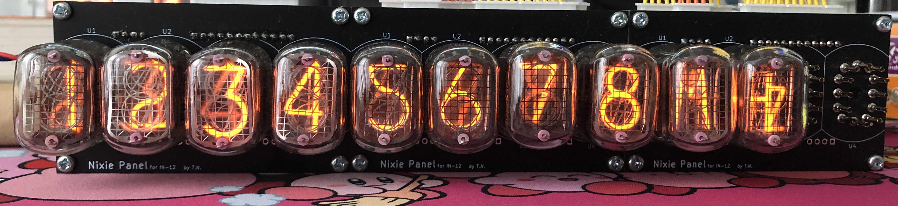
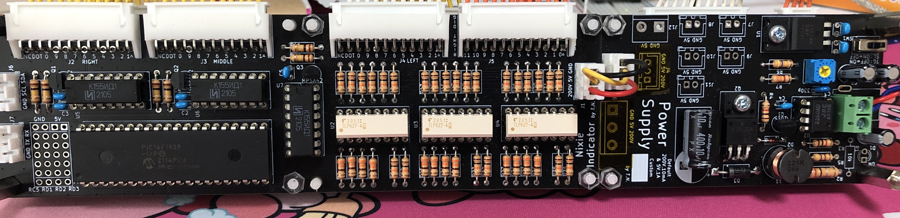

# ニキシー管表示器

## 概要

* UARTかI2Cで制御可能なニキシー管表示器
* 最大12管接続可能
* ニキシー管かっこいい

## 外観

* 前面

    

* 背面

    

## 使い方

* UARTまたはI2Cで表示する値を受け取ります。データ形式は以下の通り（現状10桁を想定）

    | 何ビット目か | 内容                                    | 
    | ------------ | --------------------------------------- | 
    | 0            | 0桁目(最上位桁)のドット(数字の左につく) | 
    | 1            | 0桁目の数字・記号                       | 
    | 2            | 1桁目のドット                           | 
    | 3            | 1桁目の数字・記号                       | 
    | 4            | 2桁目のドット                           | 
    | 5            | 2桁目の数字・記号                       | 
    | 6            | 3桁目のドット                           | 
    | 7            | 3桁目の数字・記号                       | 
    | 8            | 4桁目のドット                           | 
    | 9            | 4桁目の数字・記号                       | 
    | 10           | 5桁目のドット                           | 
    | 11           | 5桁目の数字・記号                       | 
    | 12           | 6桁目のドット                           | 
    | 13           | 6桁目の数字・記号                       | 
    | 14           | 7桁目のドット                           | 
    | 15           | 7桁目の数字・記号                       | 
    | 16           | 8桁目のドット                           | 
    | 17           | 8桁目の数字・記号                       | 
    | 18           | 9桁目のドット                           | 
    | 19           | 9桁目の数字・記号                       | 

* `$`を送ることで送信ビットのリセット(強制的に0ビット目にする)

* 送信可能文字一覧
  
    | 送信文字 | 表示文字 | 
    | -------- | -------- | 
    | 0        | 0        | 
    | 1        | 1        | 
    | 2        | 2        | 
    | 3        | 3        | 
    | 4        | 4        | 
    | 5        | 5        | 
    | 6        | 6        | 
    | 7        | 7        | 
    | 8        | 8        | 
    | 9        | 9        | 
    | .        | .        | 
    | u        | μ       | 
    | W        | W        | 
    | n        | n        | 
    | A        | A        | 
    | %        | %        | 
    | O        | Ω       | 
    | p        | Π       | 
    | k        | k        | 
    | S        | S        | 
    | M        | M        | 
    | V        | V        | 
    | m        | m        | 
    | H        | H        | 
    | +        | +        | 
    | h        | Hz       | 
    | -        | -        | 
    | P        | P        | 
    | F        | F        | 
    | ␣       | ␣       | 
    | $        | リセット | 

## その他

* 各種基板
  * [制御基板](https://github.com/kanade9600k/NixieIndicator)
  * [電源基板](https://github.com/kanade9600k/NixieTubePowerSupply)
  * [管基板](https://github.com/kanade9600k/IN-12Panel)

* ゴーストが近いので今後何とかしていきたい